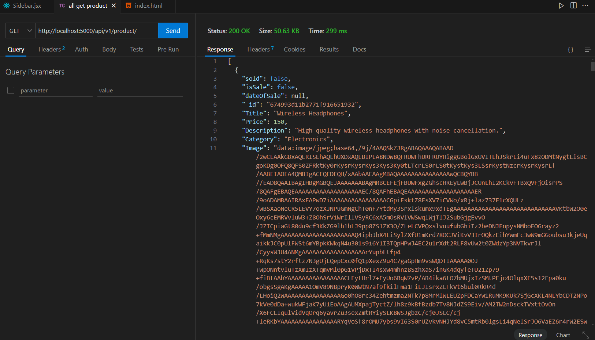

# E-Commerce Website Backend

## Project Overview

This project is the backend of an e-commerce website built using Node.js, Express, and MongoDB. It provides RESTful API endpoints for managing users and products, including user login, product retrieval, and more. The backend integrates with the database using Mongoose and supports CRUD operations for various e-commerce functionalities.

### Key Features:

1) Product Management: Retrieve product details from the database.

2) Database: MongoDB for storing user and product data.

3) API Design: RESTful APIs for seamless interaction between the frontend and backend.

### SHOPPING STORE


## Instructions to Run the Project Locally

### Prerequisites

1) Node.js installed on your system.

2) MongoDB installed and running locally or access to a cloud-based MongoDB instance.

3) npm (Node Package Manager) for installing dependencies.

### staps
Clone the Repository
```bash
  git clone https://github.com/Aayushajs/E-COMERCE-BACKEND.git
  cd .\backend\
```
Install Dependencies
```bash
npm install
```
Configure Environment Variables
Create a .env file in the root directory and 
```bash
PORT=5000
MongoDBURI=your-mongodb-connection-string
FRONTEND_URL_TWO="http://localhost:3000"
FRONTEND_URL_ONE="http://localhost:3000"
```
Run the Server
```
npm start
```
The server will start on the specified port (default is 4000) and connect to the MongoDB database

### Access the API
Use tools like Postman or Thunder Client to test API endpoints:

GET:- /api/v1/product - Fetch all products.

POST:- /api/v1/user/login - User login.


## Live Demo

The backend is deployed and can be accessed at:
Deployed Link 
<a href="https://e-comerce-backend-mf8i.onrender.com/"><strong>➥ Live Demo</strong></a>

## Screenshots

Include relevant screenshots demonstrating the application functionality:

1) Product List API Response:





## Technologies Used

**Node.js**: Backend runtime environment.

**Express.js**: Web application framework.

**MongoDB**: NoSQL database.

**Mongoose**: ODM for MongoDB

## License

This project is licensed under the MIT License.


## Support
For any questions or suggestions, please contact aayushj004@gmail.com.


## file structure
```
backend/
├── controllers/
│   ├── productController.js    # Handles product-related logic
│   └── userController.js       # Handles user-related logic
├── models/
│   ├── Product.js              # Schema for products
│   └── User.js                 # Schema for users
├── routes/
│   ├── productRoutes.js        # Defines routes for product-related APIs
│   └── userRoutes.js           # Defines routes for user-related APIs
├── .env                         # Environment variables (e.g., MONGO_URI, JWT_SECRET)
├── index.js                     # Main server file
└── package.json                 # Project dependencies and scripts
```
## File Roles
### (1) controllers/:

Contains the logic for handling requests and responses for different API endpoints.
Example: productController.js will handle operations like fetching, adding, or updating products.

### (2) models/:

Contains Mongoose schemas and models for MongoDB collections.
Example: Product.js defines the structure of the product data.

### (3) routes/:

Contains route definitions for each resource (users, products, etc.).
Example: productRoutes.js defines the URL paths and connects them to controller methods.

### (4) .env:

Stores sensitive environment variables such as database connection strings and secret keys.

### (5) index.js:

The entry point of the application. Initializes the server, connects to the database, and sets up middleware and routes.
Would you like detailed boilerplate code for any of these files?
